## Задача 1: Сравнение REPEATABLE READ и SERIALIZABLE

#### Описание проблемы
Фантомное чтение возникает, когда транзакция повторно выполняет один и тот же запрос, но получает другой набор строк из-за того, что другая транзакция вставила или удалила данные в интервале между запросами.

#### Тестовый сценарий
1. Подготовка тестовой таблицы:

```sql
DROP TABLE IF EXISTS test_products;
CREATE TABLE test_products (
    id SERIAL PRIMARY KEY,
    name VARCHAR(100) NOT NULL,
    price DECIMAL(10, 2) NOT NULL,
    stock_quantity INTEGER NOT NULL
);

INSERT INTO test_products (name, price, stock_quantity) VALUES
    ('Смартфон', 29990.00, 10),
    ('Наушники', 5990.00, 20),
    ('Планшет', 19990.00, 5);
```

#### Демонстрация с REPEATABLE READ

**Терминал 1:**
```sql
BEGIN;
SET TRANSACTION ISOLATION LEVEL REPEATABLE READ;
SELECT * FROM test_products WHERE price < 10000;
-- Должны увидеть только "Наушники", "Чехол" не появится
```
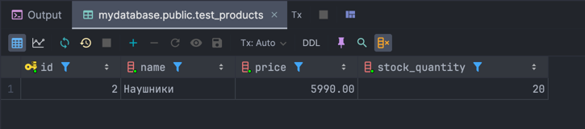

**Терминал 2:**
```sql
BEGIN;
INSERT INTO test_products (name, price, stock_quantity) VALUES ('Чехол', 999.00, 50);
COMMIT;
```
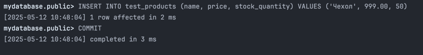
**Терминал 1:**
```sql
-- Повторяем запрос в той же транзакции
SELECT * FROM test_products WHERE price < 10000;
```

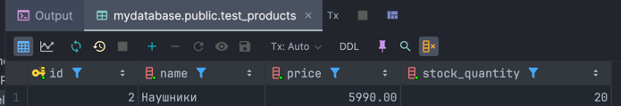

```sql
-- Теперь попробуем вставить товар с похожими характеристиками
INSERT INTO test_products (name, price, stock_quantity) VALUES ('Зарядное устройство', 1500.00, 30);
COMMIT;
```
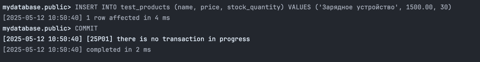

#### Демонстрация с SERIALIZABLE

```sql
-- Сначала сбросим таблицу до предыдущего состояния
DELETE FROM test_products WHERE name IN ('Чехол', 'Зарядное устройство');
```

**Терминал 1:**
```sql
BEGIN;
SET TRANSACTION ISOLATION LEVEL SERIALIZABLE;

-- Выполняем запрос, который ищет товары дешевле 10000
SELECT * FROM test_products WHERE price < 10000;
```

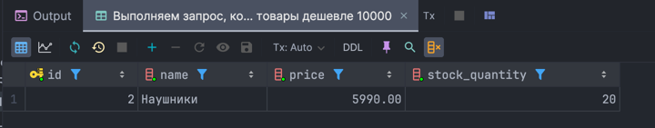

**Терминал 2:**
```sql
BEGIN;
INSERT INTO test_products (name, price, stock_quantity) VALUES ('Чехол', 999.00, 50);
COMMIT;
```
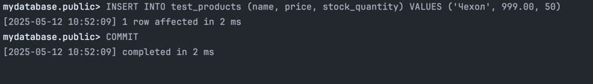

**Терминал 1:**
```sql
-- Повторяем запрос в той же транзакции
SELECT * FROM test_products WHERE price < 10000;
```

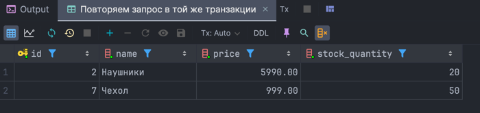

```sql
-- Теперь попробуем вставить товар с похожими характеристиками
INSERT INTO test_products (name, price, stock_quantity) VALUES ('Зарядное устройство', 1500.00, 30);
```
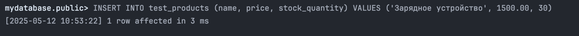

#### Анализ результатов

При уровне изоляции REPEATABLE READ:
1. Транзакция не видит изменения, сделанные другими транзакциями после начала (не видит новый товар "Чехол")
2. Транзакция может сама вставить новые данные, даже если они подходят под условия предыдущего запроса

При уровне изоляции SERIALIZABLE:
1. Транзакция также не видит изменения, сделанные другими транзакциями
2. Но при попытке вставки новых данных, которые подходят под условия предыдущего запроса, возникает ошибка сериализации

Это отличие связано с тем, что SERIALIZABLE гарантирует результат, который был бы получен при последовательном выполнении транзакций. Поскольку вставка нового товара в диапазон цен < 10000 может повлиять на результат предыдущего запроса, SERIALIZABLE обнаруживает это противоречие и предотвращает его.

### Сценарий 2: Аномалия write-skew

#### Описание проблемы
Аномалия write-skew возникает, когда две транзакции читают некоторые перекрывающиеся данные, принимают решения на основе прочитанного, а затем обновляют разные части данных, что приводит к состоянию, которое невозможно было бы получить при последовательном выполнении транзакций.

#### Тестовый сценарий

Предположим, у нас есть бизнес-правило: сумма quantity всех товаров должна быть не менее 30.

#### Демонстрация с REPEATABLE READ

**Терминал 1:**
```sql
BEGIN;
SET TRANSACTION ISOLATION LEVEL REPEATABLE READ;

-- Проверяем общее количество товаров
SELECT SUM(stock_quantity) FROM test_products;
```

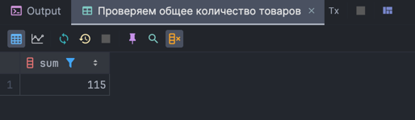

```sql
-- Уменьшаем количество первого товара на 15
UPDATE test_products SET stock_quantity = stock_quantity - 15 WHERE id = 1;
```

**Терминал 2:**
```sql
BEGIN;
SET TRANSACTION ISOLATION LEVEL REPEATABLE READ;

-- Проверяем общее количество товаров
SELECT SUM(stock_quantity) FROM test_products;
```
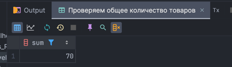

```sql
-- Уменьшаем количество второго товара на 10
UPDATE test_products SET stock_quantity = stock_quantity - 10 WHERE id = 2;
```
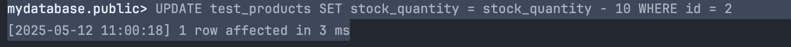
**Терминал 1:**
```sql
COMMIT;
```

**Терминал 2:**
```sql
COMMIT;
```

**После выполнения обеих транзакций:**
```sql
SELECT SUM(stock_quantity) FROM test_products;
```
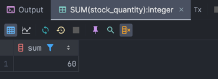
#### Демонстрация с SERIALIZABLE

```sql
-- Сбросим данные обратно
UPDATE test_products SET stock_quantity = 10 WHERE id = 1;
UPDATE test_products SET stock_quantity = 20 WHERE id = 2;
UPDATE test_products SET stock_quantity = 5 WHERE id = 3;
```
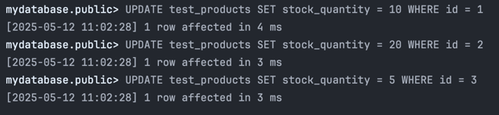
**Терминал 1:**
```sql
BEGIN;
SET TRANSACTION ISOLATION LEVEL SERIALIZABLE;

-- Проверяем общее количество товаров
SELECT SUM(stock_quantity) FROM test_products;
```


```sql
-- Уменьшаем количество первого товара на 15
UPDATE test_products SET stock_quantity = stock_quantity - 15 WHERE id = 1;
```

**Терминал 2:**
```sql
BEGIN;
SET TRANSACTION ISOLATION LEVEL SERIALIZABLE;

-- Проверяем общее количество товаров
SELECT SUM(stock_quantity) FROM test_products;
```

```sql
-- Уменьшаем количество второго товара на 10
UPDATE test_products SET stock_quantity = stock_quantity - 10 WHERE id = 2;
```

**Терминал 1:**
```sql
COMMIT;
```


**Терминал 2:**
```sql
COMMIT;
```

#### Анализ результатов

При уровне изоляции REPEATABLE READ:
1. Обе транзакции видят одинаковое начальное состояние
2. Каждая транзакция уменьшает количество разных товаров
3. Обе транзакции успешно завершаются
4. В результате общее количество товаров становится меньше допустимого

При уровне изоляции SERIALIZABLE:
1. Обе транзакции также видят одинаковое начальное состояние
2. Первая транзакция успешно завершается
3. Вторая транзакция завершается с ошибкой сериализации
4. Благодаря этому бизнес-правило не нарушается

SERIALIZABLE обнаруживает, что результат параллельного выполнения транзакций отличается от их последовательного выполнения, и предотвращает нарушение целостности данных.

## Задача 2: Выбор уровней изоляции для сценариев интернет-магазина

### Сценарий 1: Получение товаров с пагинацией

#### Описание проблемы
При реализации пагинации в интернет-магазине пользователь может столкнуться с "скачущими" результатами, если между запросами страниц другие пользователи добавляют или удаляют товары.

#### Вопрос
Может ли "скакать" пагинация, если другой пользователь будет удалять/добавлять товары? Какой уровень изоляции нужен?

#### Демонстрация проблемы (READ COMMITTED)

**Терминал 1:**
```sql
BEGIN;
SET TRANSACTION ISOLATION LEVEL READ COMMITTED;

-- Получаем первую страницу товаров
SELECT * FROM products 
WHERE category_id = 1 
ORDER BY id 
LIMIT 2 OFFSET 0;
```

**Терминал 2:**
```sql
BEGIN;
INSERT INTO products (name, description, price, stock_quantity, category_id)
VALUES ('Планшет', 'Новая модель', 15990.00, 5, 1);
COMMIT;
```

**Терминал 1:**
```sql
-- Получаем вторую страницу
SELECT * FROM products 
WHERE category_id = 1 
ORDER BY id 
LIMIT 2 OFFSET 2;
```

#### Демонстрация решения (REPEATABLE READ)

**Терминал 1:**
```sql
BEGIN;
SET TRANSACTION ISOLATION LEVEL REPEATABLE READ;

-- Получаем первую страницу товаров
SELECT * FROM products 
WHERE category_id = 1 
ORDER BY id 
LIMIT 2 OFFSET 0;
```

**Терминал 2:**
```sql
BEGIN;
INSERT INTO products (name, description, price, stock_quantity, category_id)
VALUES ('Колонка', 'Беспроводная', 3990.00, 15, 1);
COMMIT;
```

**Терминал 1:**
```sql
-- Получаем вторую страницу
SELECT * FROM products 
WHERE category_id = 1 
ORDER BY id 
LIMIT 2 OFFSET 2;
```

#### Анализ и выбор уровня изоляции

**Минимально необходимый уровень: REPEATABLE READ**

Обоснование:
- READ COMMITTED не подходит, так как позволяет видеть изменения, сделанные другими транзакциями между запросами, что приводит к "скачкам" пагинации
- REPEATABLE READ обеспечивает стабильный снимок данных на протяжении всей транзакции, что гарантирует согласованную пагинацию
- SERIALIZABLE избыточен, так как для стабильной пагинации достаточно гарантий REPEATABLE READ

### Сценарий 2: Получение содержимого корзины и его итоговой суммы

#### Описание проблемы
При отображении корзины покупателя и расчете итоговой суммы может возникнуть несогласованность, если цены товаров изменяются между запросами.

#### Вопрос
Другой пользователь одновременно с отображением корзины может изменить цену какого-то товара из корзины. Какой уровень изоляции минимально необходим?

#### Демонстрация проблемы (READ COMMITTED)

**Терминал 1:**
```sql
BEGIN;
SET TRANSACTION ISOLATION LEVEL READ COMMITTED;

-- Получаем товары в корзине
SELECT p.id, p.name, p.price, ci.quantity
FROM cart_items ci
JOIN products p ON ci.product_id = p.id
WHERE ci.cart_id = 1;
```

**Терминал 2:**
```sql
BEGIN;
UPDATE products SET price = 27990.00 WHERE id = 1; -- Снижаем цену на смартфон
COMMIT;
```

**Терминал 1:**
```sql
-- Рассчитываем итоговую сумму
SELECT SUM(p.price * ci.quantity) AS total_amount
FROM cart_items ci
JOIN products p ON ci.product_id = p.id
WHERE ci.cart_id = 1;
```

#### Демонстрация решения (REPEATABLE READ)

**Терминал 1:**
```sql
BEGIN;
SET TRANSACTION ISOLATION LEVEL REPEATABLE READ;

-- Получаем товары в корзине
SELECT p.id, p.name, p.price, ci.quantity
FROM cart_items ci
JOIN products p ON ci.product_id = p.id
WHERE ci.cart_id = 1;
```


**Терминал 2:**
```sql
BEGIN;
UPDATE products SET price = 25990.00 WHERE id = 1; -- Снижаем цену на смартфон еще сильнее
COMMIT;
```


**Терминал 1:**
```sql
-- Рассчитываем итоговую сумму
SELECT SUM(p.price * ci.quantity) AS total_amount
FROM cart_items ci
JOIN products p ON ci.product_id = p.id
WHERE ci.cart_id = 1;
```

#### Анализ и выбор уровня изоляции

**Минимально необходимый уровень: REPEATABLE READ**

Обоснование:
- READ COMMITTED позволяет видеть изменения, сделанные другими транзакциями между запросами, что приводит к несогласованности между отображаемыми ценами и итоговой суммой
- REPEATABLE READ обеспечивает согласованный снимок данных, гарантируя, что пользователь видит одни и те же цены на протяжении всего процесса работы с корзиной
- SERIALIZABLE избыточен, так как для согласованного чтения достаточно гарантий REPEATABLE READ

### Сценарий 3: Проверка наличия товара перед оформлением заказа

#### Описание проблемы
При оформлении заказов возникает риск overselling (продажи товаров в количестве, превышающем имеющееся на складе), если несколько пользователей одновременно заказывают один и тот же товар с ограниченным количеством.

#### Вопрос
Два пользователя одновременно заказывают один и тот же товар, хотя в наличии всего одна штука. Какой уровень изоляции предотвратит overselling?

#### Демонстрация проблемы (REPEATABLE READ)

```sql
-- Сначала установим количество товара в 1 штуку
UPDATE products SET stock_quantity = 1 WHERE id = 1;
```

**Терминал 1:**
```sql
BEGIN;
SET TRANSACTION ISOLATION LEVEL REPEATABLE READ;

-- Проверяем наличие товара
SELECT id, name, stock_quantity FROM products WHERE id = 1;
```

**Терминал 2:**
```sql
BEGIN;
SET TRANSACTION ISOLATION LEVEL REPEATABLE READ;

-- Проверяем наличие товара
SELECT id, name, stock_quantity FROM products WHERE id = 1;
```

**Терминал 1:**
```sql
-- Создаем заказ
INSERT INTO orders (user_id, status, total_amount)
VALUES (1, 'Оформлен', 29990.00)
RETURNING id;

-- Добавляем товар в заказ
INSERT INTO order_items (order_id, product_id, quantity, price)
VALUES (1, 1, 1, 29990.00);

-- Обновляем количество товара
UPDATE products SET stock_quantity = stock_quantity - 1 WHERE id = 1;

COMMIT;
```

**Терминал 2:**
```sql
-- Создаем заказ
INSERT INTO orders (user_id, status, total_amount)
VALUES (2, 'Оформлен', 29990.00)
RETURNING id;

-- Добавляем товар в заказ
INSERT INTO order_items (order_id, product_id, quantity, price)
VALUES (2, 1, 1, 29990.00);

-- Обновляем количество товара
UPDATE products SET stock_quantity = stock_quantity - 1 WHERE id = 1;

COMMIT;
```

```sql
-- Проверяем результат
SELECT id, name, stock_quantity FROM products WHERE id = 1;
```

#### Демонстрация решения (SERIALIZABLE)

```sql
-- Сначала вернем товар в наличие
UPDATE products SET stock_quantity = 1 WHERE id = 1;
```

**Терминал 1:**
```sql
BEGIN;
SET TRANSACTION ISOLATION LEVEL SERIALIZABLE;

-- Проверяем наличие товара
SELECT id, name, stock_quantity FROM products WHERE id = 1;
```

**Терминал 2:**
```sql
BEGIN;
SET TRANSACTION ISOLATION LEVEL SERIALIZABLE;

-- Проверяем наличие товара
SELECT id, name, stock_quantity FROM products WHERE id = 1;
```

**Терминал 1:**
```sql
-- Создаем заказ
INSERT INTO orders (user_id, status, total_amount)
VALUES (1, 'Оформлен', 29990.00)
RETURNING id;

-- Добавляем товар в заказ
INSERT INTO order_items (order_id, product_id, quantity, price)
VALUES (3, 1, 1, 29990.00);

-- Обновляем количество товара
UPDATE products SET stock_quantity = stock_quantity - 1 WHERE id = 1;

COMMIT;
```

**Терминал 2:**
```sql
-- Создаем заказ
INSERT INTO orders (user_id, status, total_amount)
VALUES (2, 'Оформлен', 29990.00)
RETURNING id;

-- Добавляем товар в заказ
INSERT INTO order_items (order_id, product_id, quantity, price)
VALUES (4, 1, 1, 29990.00);

-- Обновляем количество товара
UPDATE products SET stock_quantity = stock_quantity - 1 WHERE id = 1;

COMMIT;
```

#### Анализ и выбор уровня изоляции

**Минимально необходимый уровень: SERIALIZABLE**

Обоснование:
- READ COMMITTED и REPEATABLE READ не предотвращают проблему overselling, так как обе транзакции видят одно и то же начальное количество товара и могут уменьшить его ниже допустимого предела
- REPEATABLE READ может привести к аномалии write-skew, когда обе транзакции успешно завершаются, но совокупный результат их действий нарушает бизнес-правила
- SERIALIZABLE необходим, так как он обеспечивает такой результат, как если бы транзакции выполнялись последовательно

### Сценарий 4: Агрегирование данных

#### Описание проблемы
При формировании отчетов и аналитики важно получать согласованные результаты агрегирующих функций, даже если параллельно происходят изменения данных.

#### Вопрос
Вы делаете SELECT COUNT(*) по фильтру. Одновременно с этим другой пользователь удаляет/добавляет товары в категорию. Какой уровень изоляции даст вам точный, воспроизводимый результат?

#### Демонстрация проблемы (READ COMMITTED)

**Терминал 1:**
```sql
BEGIN;
SET TRANSACTION ISOLATION LEVEL READ COMMITTED;

-- Считаем количество товаров в категории "Электроника"
SELECT COUNT(*) FROM products WHERE category_id = 1;
```

**Терминал 2:**
```sql
BEGIN;
INSERT INTO products (name, description, price, stock_quantity, category_id)
VALUES ('Телевизор', 'Smart TV', 49990.00, 3, 1);
COMMIT;
```

**Терминал 1:**
```sql
-- Повторно запрашиваем агрегированные данные
SELECT COUNT(*) FROM products WHERE category_id = 1;
```

```sql
-- Считаем среднюю цену товаров
SELECT AVG(price) FROM products WHERE category_id = 1;
```

#### Демонстрация решения (REPEATABLE READ)

**Терминал 1:**
```sql
BEGIN;
SET TRANSACTION ISOLATION LEVEL REPEATABLE READ;

-- Считаем количество товаров в категории "Электроника"
SELECT COUNT(*) FROM products WHERE category_id = 1;
```

**Терминал 2:**
```sql
BEGIN;
INSERT INTO products (name, description, price, stock_quantity, category_id)
VALUES ('Фотоаппарат', 'Цифровой', 35990.00, 2, 1);
COMMIT;
```

**Терминал 1:**
```sql
-- Повторно запрашиваем агрегированные данные
SELECT COUNT(*) FROM products WHERE category_id = 1;
```

```sql
-- Считаем среднюю цену товаров
SELECT AVG(price) FROM products WHERE category_id = 1;
```

#### Анализ и выбор уровня изоляции

**Минимально необходимый уровень: REPEATABLE READ**

Обоснование:
- READ COMMITTED не подходит, так как позволяет видеть изменения, сделанные другими транзакциями между запросами, что приводит к несогласованным результатам агрегации
- REPEATABLE READ обеспечивает стабильный снимок данных, гарантируя согласованные результаты агрегирующих функций
- SERIALIZABLE избыточен, так как для согласованного чтения достаточно гарантий REPEATABLE READ

## Выводы и рекомендации

### Основные различия между уровнями изоляции

1. **READ COMMITTED**:
   - Предотвращает только грязное чтение (чтение незафиксированных данных)
   - Позволяет неповторяющееся чтение и фантомное чтение
   - Высокая производительность, низкая защита от аномалий

2. **REPEATABLE READ**:
   - Предотвращает грязное чтение и неповторяющееся чтение
   - В PostgreSQL частично предотвращает фантомное чтение за счет MVCC
   - Не защищает от аномалий write-skew
   - Хороший баланс между производительностью и защитой

3. **SERIALIZABLE**:
   - Предотвращает все типы аномалий
   - Гарантирует результат, эквивалентный последовательному выполнению транзакций
   - Использует механизм Serializable Snapshot Isolation (SSI) в PostgreSQL
   - Может приводить к ошибкам сериализации, требующим повторного выполнения транзакций
   - Наиболее строгая защита, наименьшая производительность

### Рекомендации по выбору уровня изоляции

1. **READ COMMITTED (по умолчанию в PostgreSQL)**:
   - Подходит для простых операций чтения, не требующих стабильного снимка данных
   - Для операций, где важна производительность, а несогласованность не критична
   - Не рекомендуется для сложных бизнес-процессов с несколькими связанными запросами

2. **REPEATABLE READ**:
   - Рекомендуется для большинства операций чтения с несколькими запросами (пагинация, отчеты)
   - Для операций, где важна согласованность данных в рамках транзакции (отображение корзины)
   - Для аналитических запросов, требующих согласованных результатов агрегации

3. **SERIALIZABLE**:
   - Рекомендуется для критически важных бизнес-операций, где нельзя допустить нарушение целостности (оформление заказа, финансовые операции)
   - Для операций, где важно предотвратить аномалии write-skew
   - Для случаев, когда нужно гарантировать, что параллельные транзакции дают такой же результат, как и последовательные

### Итоговая таблица рекомендаций для интернет-магазина

| Операция | Минимальный уровень изоляции | Причина |
|----------|------------------------------|---------|
| Просмотр списка товаров (без пагинации) | READ COMMITTED | Простое чтение, согласованность не критична |
| Просмотр списка товаров с пагинацией | REPEATABLE READ | Предотвращение "скачков" пагинации |
| Отображение корзины и расчет итоговой суммы | REPEATABLE READ | Согласованность цен при отображении и расчете |
| Оформление заказа с проверкой наличия | SERIALIZABLE | Предотвращение overselling |
| Аналитика и отчеты | REPEATABLE READ | Согласованные результаты агрегации |
| Обновление каталога товаров администратором | READ COMMITTED | Простые операции записи, не требующие защиты от аномалий | 